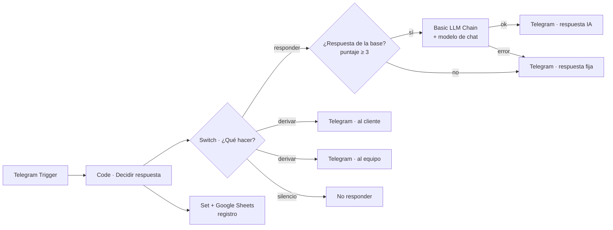

# Guía técnica: bot de atención con n8n e IA

Esta guía explica cómo poner el bot en producción, cómo está construido por
dentro y por qué se tomaron ciertas decisiones. Para probarlo rápido basta el
[README](README.md).

---

## 1. Arquitectura



| Nodo | Qué hace |
| --- | --- |
| **Decidir respuesta** (Code) | Toda la lógica. Recibe el mensaje y devuelve `accion` (`responder`, `derivar`, `silencio`), `intencion`, `puntaje`, `respuesta`, `contexto` y `aviso_equipo`. |
| **¿Qué hacer?** (Switch) | Reparte según `accion`. |
| **¿Respuesta de la base?** (If) | Solo las respuestas que salen de la base pasan por la IA. Saludos, aclaraciones y avisos se envían tal cual: no vale la pena pagar un modelo para decir "hola". |
| **IA · Redactar respuesta** (Basic LLM Chain) | Reescribe la respuesta en tono natural usando solo el contexto. Está configurado con *On Error → Continue (using error output)*: si el modelo falla, la rama de error envía el texto de la base. |
| **Fila de registro → Sheets** | Guarda cada mensaje, con o sin respuesta. |

### Cómo decide

1. `/start` o `menu` → devuelve el chat al bot.
2. Si un asesor tomó el chat hace menos de 24 h → silencio.
3. Mensaje vacío (foto, sticker) → pide texto.
4. Frases de derivación (`asesor`, `persona real`, `reclamo`, `estafa`…) → deriva. Se comparan palabras completas: "asesoramiento" no deriva.
5. Saludo o despedida pura → texto fijo.
6. Busca en la base: 3 puntos por palabra clave y 1 por palabra de los ejemplos. Con 3 o más, responde.
7. Si no llega a 3: la primera vez pide aclarar; la segunda vez seguida, deriva.

La memoria de conversación (quién está con un asesor, cuántas veces no se
entendió) vive en `workflowStaticData`, así que no hace falta base de datos.

---

## 2. Puesta en producción

### 2.1 Bot de Telegram

1. En Telegram, habla con **@BotFather** → `/newbot` → copia el token.
2. En n8n: **Credentials → New → Telegram API** y pega el token.
3. Crea un grupo para el equipo, agrega al bot y obtén el ID del grupo (por
   ejemplo, reenviando un mensaje del grupo a **@userinfobot**). Es un número
   negativo.

> Telegram exige una URL pública con **HTTPS** para enviar los mensajes al
> trigger. En local puedes usar un túnel (`cloudflared tunnel --url
> http://localhost:5678`) y poner esa URL en `WEBHOOK_URL` del
> `docker-compose.yml`.

### 2.2 Modelo de IA

El workflow trae el nodo **OpenAI Chat Model** con `gpt-4o-mini`, temperatura
0.2 y máximo 300 tokens. Crea la credencial **OpenAI API** en n8n.

Se puede cambiar por cualquier otro modelo de chat de n8n (Anthropic, Google
Gemini, Ollama local) reemplazando solo ese nodo: la cadena y el prompt no
cambian.

### 2.3 Hoja de registro

Crea una Google Sheet con una pestaña `Conversaciones` y estas columnas:

```
fecha | chat_id | mensaje | accion | intencion | puntaje
```

### 2.4 Reemplazos en el workflow

Importa `workflows/bot_produccion.json` y completa:

| Nodo | Qué reemplazar |
| --- | --- |
| Telegram · Mensaje entrante, y los 4 nodos Telegram | Credencial Telegram API |
| Telegram · Avisar al equipo | `REEMPLAZAR_CHAT_EQUIPO` → ID del grupo |
| Modelo de IA | Credencial OpenAI (u otro proveedor) |
| Sheets · Registrar conversación | `REEMPLAZAR_ID_HOJA` → ID de la URL de la hoja, y credencial de Google |

Activa el workflow. Desde ese momento el bot responde.

---

## 3. Mantener la base de conocimiento

El negocio solo edita `data/faq.json`. Cada entrada tiene:

| Campo | Para qué |
| --- | --- |
| `id` | Nombre corto; aparece en el registro como `intencion`. |
| `pregunta` / `respuesta` | Lo que se muestra y lo que recibe la IA como contexto. |
| `palabras_clave` | Valen 3 puntos. Deben ser palabras que casi solo aparecen en ese tema. |
| `ejemplos` | Formas reales en que la gente pregunta. Cada palabra vale 1 punto. |

Después de editar:

```bash
python scripts/build_workflow.py   # inyecta la base en los workflows
python scripts/evaluar_bot.py      # comprueba que el acierto no bajó
```

y vuelve a importar el workflow.

**Consejo:** revisa en la hoja de registro los mensajes con `intencion =
aclarar`. Son las preguntas que la base todavía no cubre.

---

## 4. Decisiones de diseño

- **La búsqueda no la hace la IA.** Una búsqueda por palabras es gratis,
  instantánea y se puede probar con tests. La IA solo redacta, y lo hace con
  las 3 FAQs más cercanas. Así no inventa datos y el costo por mensaje es bajo.
- **Puntajes enteros.** Con decimales, Python y JavaScript pueden redondear
  distinto y el test de paridad fallaría por diferencias mínimas.
- **Reclamos siempre a una persona.** Un reclamo contestado por una máquina
  enoja más al cliente. La evaluación no tolera ni un reclamo mal clasificado.
- **Sin credenciales en el repositorio.** Los workflows usan marcadores
  `REEMPLAZAR_*`; un test revisa que no haya tokens ni API keys.

---

## 5. Problemas conocidos de n8n (encontrados al probar)

- **Reimportar un workflow activo no cambia la versión activa.** En n8n 2.x,
  `import:workflow` sobre un ID que ya está activo guarda el cambio, pero las
  ejecuciones siguen usando la versión anterior. Desactívalo, impórtalo y
  vuelve a activarlo.
- **La memoria del bot no se guarda en ejecuciones manuales.** `workflowStaticData`
  solo persiste cuando el workflow está activo y lo dispara un trigger. Si
  pruebas con *Test workflow*, cada mensaje empieza sin memoria.
- **El nodo Webhook envuelve el JSON en `body`.** Por eso `extraerMensaje`
  acepta tanto el update directo del trigger de Telegram como uno reenviado
  por webhook.
