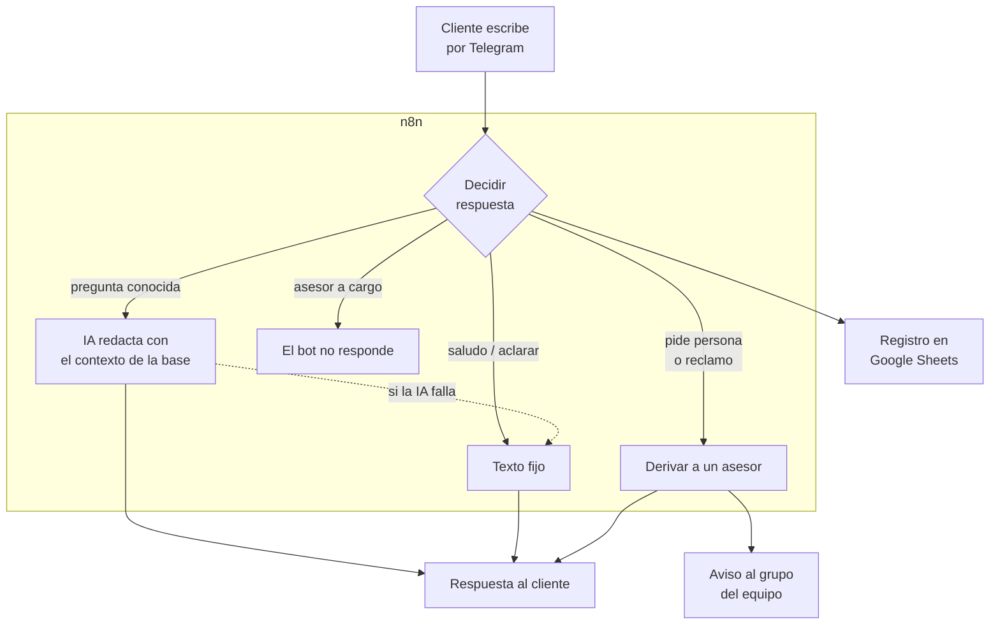
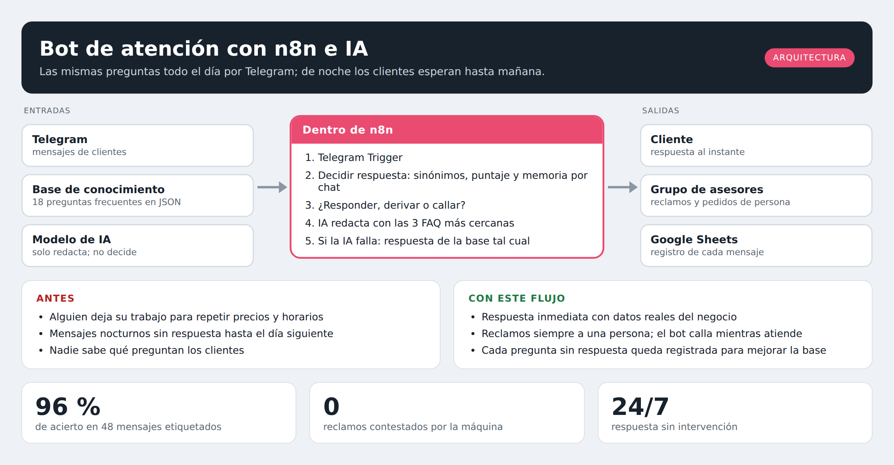
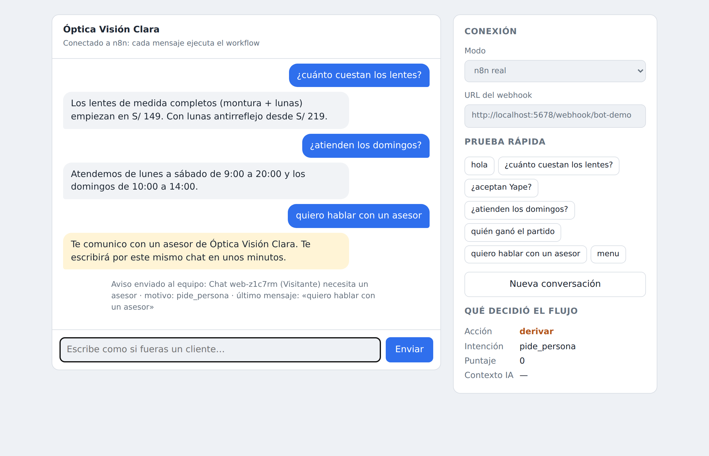
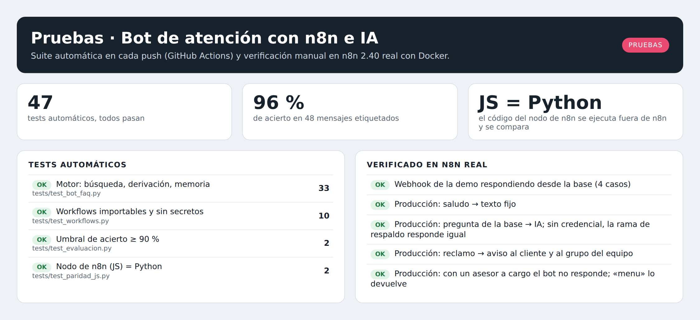
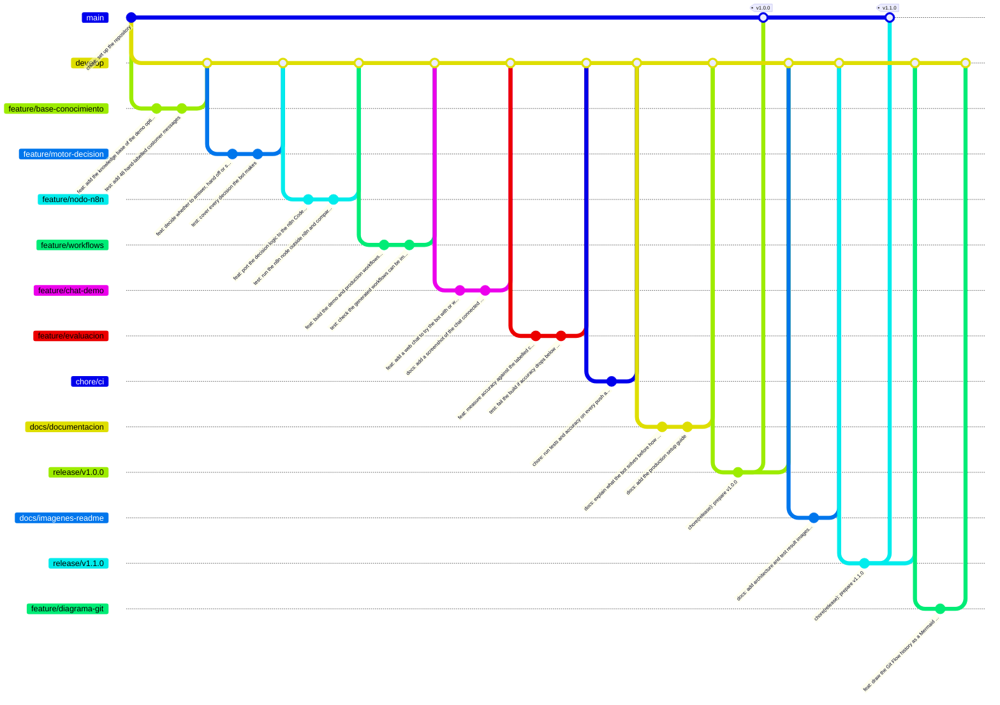

<h1 align="center">Bot de atención con n8n e IA</h1>

<p align="center"><i>Contesta lo que sabe, deriva lo que no y nunca inventa un precio</i></p>

<p align="center">
  
  
  
  
  
</p>

---

## Para qué existe este repositorio

Un negocio pequeño recibe por Telegram las mismas preguntas todo el día: precios, horarios, si aceptan Yape, cuánto demora el pedido. Alguien del equipo deja lo que está haciendo para contestar lo mismo por décima vez, y de noche los mensajes esperan hasta el día siguiente.

**Este flujo contesta al instante lo que está en la base de conocimiento del negocio, le pasa la conversación a una persona cuando el cliente la pide o reclama, y registra cada mensaje en una hoja de cálculo.**

La IA solo redacta la respuesta; no decide el contenido. Por eso no puede inventar un precio ni una promoción que no existe.



---

## Arquitectura

<p align="center"></p>

---

## Demo

<!-- VIDEO: arrastra aquí el .mp4 al editar el README en GitHub y deja solo la URL que genera. -->

<p align="center"></p>

<p align="center"><i>El chat de demostración conectado al workflow de n8n: responde desde la
base, deriva al pedir un asesor y el panel muestra qué decidió el flujo.</i></p>

---

## Qué hace este proyecto

1. **Busca en la base de conocimiento** (`data/faq.json`): 18 preguntas frecuentes de una óptica ficticia. Entiende sinónimos ("cuánto vale", "precio", "cuestan") y no le importan las tildes ni las mayúsculas.
2. **Responde con IA, pero atada al contexto.** Pasa las 3 FAQs más parecidas al modelo y le prohíbe salirse de ellas. Si el modelo falla o se cae, envía la respuesta de la base tal cual: el cliente nunca se queda sin respuesta.
3. **Deriva a una persona** cuando el cliente pide un asesor, reclama o el bot no entiende dos veces seguidas. Avisa al grupo del equipo con el chat, el nombre y el último mensaje.
4. **Se calla mientras el asesor atiende.** Durante 24 horas no interrumpe esa conversación; el cliente puede volver al bot escribiendo `menu`.
5. **Registra todo** en Google Sheets: mensaje, decisión, intención y puntaje, para ver qué preguntan y qué falta en la base.

---

## Pruebas

<p align="center"></p>

La integración continua corre todos los tests en cada push. Lo de la columna
derecha se verificó importando los workflows en n8n 2.40 con Docker.

---

## Probarlo en 2 minutos

```bash
pip install pytest
python scripts/evaluar_bot.py       # acierto sobre 48 mensajes etiquetados
python -m pytest -v                 # 47 tests
```

También puedes abrir `chat_demo/index.html` con doble clic: en modo simulado
funciona sin instalar nada.

**Con n8n de verdad** (Docker):

```bash
docker compose up -d
docker exec bot_atencion_n8n n8n import:workflow --input=/workflows/bot_demo.json
docker exec bot_atencion_n8n n8n update:workflow --id=botatenciondemo --active=true
docker restart bot_atencion_n8n
```

En el chat de demostración elige **n8n real** y escribe: cada mensaje ejecuta el
workflow. La configuración de producción (Telegram, modelo de IA y Google
Sheets) está en [`GUIA.md`](GUIA.md).

---

## Cómo se mide que funciona

`data/conversaciones_prueba.csv` tiene 48 mensajes de clientes escritos a mano,
cada uno con la intención correcta. `scripts/evaluar_bot.py` los pasa por el bot
en orden, con memoria de conversación, y cuenta los aciertos.

| Resultado | |
| --- | --- |
| Aciertos | 46 de 48 (96 %) |
| Reclamos o pedidos de asesor mal clasificados | 0 (la CI no tolera ninguno) |
| Fallos conocidos | «precio de monturas para niños» (niños vs. precios) y «agendar un turno para examen» (cita vs. examen) |

Los dos fallos son empates reales entre dos respuestas válidas. En producción
no le llegan mal al cliente: la IA recibe ambas FAQs en el contexto.

Si un cambio baja el acierto del 90 %, la integración continua lo rechaza.

---

### El detalle que más cuesta ver

La lógica existe **dos veces**: en Python, para probarla, y en el nodo Code de n8n, para que corra en el flujo. Dos copias que se desincronizan en silencio son un bug esperando a pasar. Por eso un test **ejecuta el código del nodo fuera de n8n** y compara, mensaje por mensaje, contra Python, incluyendo tildes combinantes de macOS y emojis.

La base de conocimiento tampoco se copia a mano: `scripts/build_workflow.py` la inyecta en el nodo, y la CI falla si el JSON del workflow no coincide con el código fuente.

---

## Estructura

```
├── data/
│   ├── faq.json                   # base de conocimiento (lo único que edita el negocio)
│   └── conversaciones_prueba.csv  # 48 mensajes etiquetados para medir el acierto
├── src/bot_faq.py                 # la lógica: buscar, decidir, derivar
├── workflows/
│   ├── src/responder_mensaje.js   # el código del nodo de n8n, revisable
│   ├── bot_demo.json              # importable, corre SIN credenciales
│   └── bot_produccion.json        # Telegram + IA + Google Sheets
├── chat_demo/                     # chat web: modo simulado o conectado a n8n
├── scripts/                       # build de workflows y evaluación
├── tests/                         # 47 tests (incluye paridad JS ↔ Python)
└── docker-compose.yml             # n8n self-hosted
```

---

## Flujo de trabajo con Git

El repositorio sigue **Git Flow**: `main` siempre desplegable, `develop` como
integración, y una rama por cambio. Los merges son `--no-ff` para que cada
funcionalidad quede como un bloque legible en el historial, y cada versión
lleva su tag.



<p align="center"><i>Historial real del repositorio hasta v1.1.0, generado con
<code>python scripts/diagrama_git.py</code>.</i></p>

| Rama | Para qué |
| --- | --- |
| `main` | Solo versiones liberadas. Cada merge lleva su tag. |
| `develop` | Integración de todo lo terminado. |
| `feature/*` | Una funcionalidad nueva. |
| `fix/*` | Una corrección concreta. |
| `release/*` | Preparación de la versión; luego se fusiona a `main` y `develop`. |

Los mensajes siguen [Conventional Commits](https://www.conventionalcommits.org/):
`feat:`, `fix:`, `test:`, `docs:`, `chore:`, con el porqué del cambio en el cuerpo.

---

## Documentación

| Documento | Contenido |
| --- | --- |
| [`GUIA.md`](GUIA.md) | Puesta en producción: bot de Telegram, modelo de IA, hoja de registro y decisiones de diseño |
| [`CHANGELOG.md`](CHANGELOG.md) | Cambios por versión |

---

## Licencia

[MIT](LICENSE) · Daniel Yataco Blas

> Proyecto de demostración construido con **datos ficticios**. La óptica, sus
> precios y los clientes no existen.
